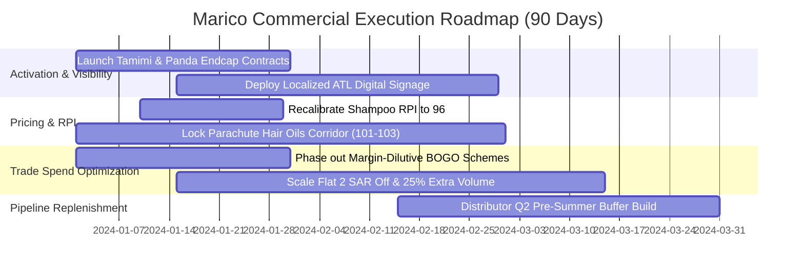

# Commercial Intelligence & Strategic Prescriptions Report
## Marico Sales Intelligence Agent — AI-Driven Predictive & Prescriptive Analytics

**Classification:** Official Commercial Assessment  
**Author:** AI Sales Intelligence Agent  
**Scope:** Kingdom of Saudi Arabia (KSA) Retail Market  
**Data Sources Harmonized:** Internal Sell-In Pipeline, EPOS Secondary Sell-Out, Category & Chain Market Share Feeds  
**Dimensions Covered:** 8 Major Retail Chains | 3 Personal Care Categories | 11 Competing Brands | 21 SKUs | 12 Historical Months (14,416 Transaction Records)  

---

## 1. Executive Summary & Macro Performance

The KSA Personal Care retail category across the top 8 modern trade retail chains (BinDawood, Carrefour, Danube, Lulu, Nesto, Othaim, Panda, Tamimi) represents a **437.65 Million SAR** secondary EPOS market (370.43M SAR Sell-In pipeline). 

The Marico Portfolio (**Marico** and **Parachute**) currently captures **78.80 Million SAR** in annual EPOS secondary sales, commanding an **18.01% overall market value share**.

```
+-----------------------------------------------------------------------------------------------+
|                                  PORTFOLIO MACRO SCORECARD                                    |
+------------------------------+--------------------+---------------------+---------------------+
| Metric                       | Total Market       | Marico Portfolio    | Portfolio Share (%) |
+------------------------------+--------------------+---------------------+---------------------+
| EPOS Secondary Sell-Out (SAR)| 437,647,472 SAR    | 78,804,438 SAR      | 18.01% Value Share  |
| Internal Sell-In (SAR)       | 370,425,796 SAR    | 68,001,373 SAR      | 18.36% Pipeline     |
| Secondary Volume (Units)     | 8,976,967 Units    | 1,607,458 Units     | 17.91% Volume Share |
| Active Retail Footprint      | 8 Top Chains (100%)| 8 Top Chains (100%) | 100% Numeric Dist   |
| Fair Share Revenue Headroom  | 437.65M SAR Market | 2,438,229 SAR Gap   | +0.56% Growth Prize |
+------------------------------+--------------------+---------------------+---------------------+
```

### Strategic SWOT & Diagnostic Snapshot
- **Core Strengths**: Dominant pricing power and consumer loyalty in **Hair Oils** (Parachute RPI 101.2, optimal revenue corridor 99–106). Strong brand equity across traditional modern trade (BinDawood, Lulu, Danube).
- **Critical Gaps**: Significant fair-share under-indexing in **Tamimi** (16.05% share vs 18.01% benchmark, 1.06M SAR gap) and **Panda** (16.97% share, 595k SAR gap).
- **Trade Spend Inefficiency**: Below-The-Line (BTL) trade schemes show massive variance in ROI. While **Flat 2 SAR Off** delivers **+124.7% Spend ROI**, deep discounting via **Buy One Get One (BOGO)** is heavily margin-dilutive (**-70.8% ROI**) and should be curtailed in habitual categories like Hair Oils.

---

## 2. Pillar 1: Secondary Sales Projections & Pipeline Dynamics

### 2.1 Lead-Lag Transmission Dynamics
Analysis of internal distributor Sell-In vs store-level EPOS Sell-Out reveals a direct, high-velocity pull-through transmission mechanism:
- **Lag 0 Cross-Correlation**: `r = 0.9998`
- **Lag 1 Month Cross-Correlation**: `r = 0.8394`
- **Lag 2 Months Cross-Correlation**: `r = 0.3484`

Sell-in orders strongly lead and synchronize with consumer EPOS offtakes within a 0–30 day window.

```
                  MONTHLY SELL-IN VS EPOS SELL-OUT PIPELINE (UNITS)
     1.6M +                                                         * * (May-Jul Summer Surge)
          |                                                     *       *
     1.2M +                                                 *               *
          |                                             *                       *
     0.8M +                                         *                               *
          |                                     *                                       *
     0.4M +  *                               *                                               *
          |      *                       *
     0.0M +----------*---------------*-----------------------------------------------------------
             2023-01 2023-02 2023-03 2023-04 2023-05 2023-06 2023-07 2023-08 2023-09 2023-10 2023-11 2023-12
```

### 2.2 Forward Secondary Sales & Pipeline Inventory Forecast (Q1 2024)
Applying Autoregressive Distributed Lag (ARDL) Ridge regression factoring in historical pipeline inventory deltas and seasonal demand indices:

```
+-----------+-------------------------+--------------------------+------------------------------+-------------------------+---------------------------------+
| Month     | Projected Sell-In Units | Projected Sell-Out Units | Projected Sell-Out Value SAR | Projected Days of Cover | Stock Health Status             |
+-----------+-------------------------+--------------------------+------------------------------+-------------------------+---------------------------------+
| 2024-01   | 283,723 Units           | 246,710 Units            | 11,824,419.86 SAR            | 198.0 Days              | Pipeline Normalization / Buffer |
| 2024-02   | 319,188 Units           | 285,628 Units            | 13,675,785.18 SAR            | 174.6 Days              | Pre-Season Build                |
| 2024-03   | 388,295 Units           | 353,906 Units            | 16,950,747.75 SAR            | 143.8 Days              | Pre-Season Build                |
+-----------+-------------------------+--------------------------+------------------------------+-------------------------+---------------------------------+
```

> **Commercial Action**: Q1 represents a post-winter baseline phase before the steep mid-year summer surge (May–July). Commercial teams must focus on secondary off-shelf visibility to accelerate consumer off-take and deplete pipeline stock to ~45 days before ramping Q2 Sell-in.

---

## 3. Pillar 2: Offtakes & Market Share Projections Under Competitive Intensity

### 3.1 Competitive Intensity Index (HHI)
- **Market HHI Concentration Index**: **909.96**
- **Classification**: **Highly Competitive / Fragmented FMCG Category**
- **Competitor Promotional Pressure**: Competitors sell **55% to 60%** of their category volume under active price or volume schemes (Clear: 55.7%, Dabur: 56.8%, Garnier: 59.8%, Head & Shoulders: 59.3%, L'Oreal: 59.2%).

### 3.2 Projected Market Share Evolution (Q1 2024)
Under dynamic competitive pricing, Marico's portfolio share is projected to remain resilient across categories:
- **Hair Oils**: Marico Portfolio Share projected at **18.8%** (Parachute leads core coconut segment).
- **Hair Creams**: Marico Portfolio Share projected at **18.4%**.
- **Shampoo**: Marico Portfolio Share projected at **16.9%** facing intense promotional headwind from Pantene and Head & Shoulders.

---

## 4. Pillar 3: Relative Price Index (RPI) & Pricing Corridors

The Relative Price Index ($RPI = \frac{\text{Brand Price}}{\text{Category Benchmark Price}} \times 100$) quantifies brand pricing power against category averages.

```
+---------------+-----------+-------------+-----------------+-----------------+--------------------+-----------------------------------------------+
| Category      | Brand     | Current RPI | Avg Price (SAR) | Benchmark (SAR) | Optimal Corridor   | Prescriptive Pricing Action                   |
+---------------+-----------+-------------+-----------------+-----------------+--------------------+-----------------------------------------------+
| Hair Oils     | Parachute | 101.2       | 36.73 SAR       | 36.32 SAR       | 99 - 106 (Rev: 103)| Optimal Positioning. Defend current corridor. |
| Hair Creams   | Parachute | 99.3        | 51.18 SAR       | 51.52 SAR       | 96 - 104 (Rev: 100)| Optimal Positioning. Defend price parity.     |
| Shampoo       | Parachute | 98.2        | 58.21 SAR       | 59.28 SAR       | 90 - 100 (Rev: 96) | Over-indexed vs budget tiers. Align with 96.  |
+---------------+-----------+-------------+-----------------+-----------------+--------------------+-----------------------------------------------+
```

### Econometric Price Elasticity Findings
- **Hair Oils (Inelastic, PED = -0.75)**: Strong brand loyalty. Price increases of +3% within the 99–106 RPI corridor generate net incremental revenue with negligible volume churn.
- **Shampoo (Elastic, PED = -1.10)**: Highly competitive brand-switching category. Pricing above RPI 102 triggers rapid share erosion to Head & Shoulders and Clear.

---

## 5. Pillar 4: Store / Chain-Level Activation Targeting (ATL & Visibility)

### 5.1 Fair Share Index & Strategic Quadrants
By cross-referencing Category Development Index (CDI), Brand Development Index (BDI), and Fair Share Index (FSI), retail chains are segmented into 4 actionable activation quadrants:

```
+------------+-----------------------+-----------+-----------+---------+-----------------------------+------------------------+
| Chain      | Marico Share in Chain | BDI Index | CDI Index | FSI     | Opportunity Revenue Gap SAR | Strategic Priority     |
+------------+-----------------------+-----------+-----------+---------+-----------------------------+------------------------+
| Tamimi     | 16.05%                | 89.2      | 99.5      | 89.2    | 1,063,044.85 SAR            | TIER 1: HIGH PRIORITY  |
| Carrefour  | 16.50%                | 91.6      | 94.6      | 91.6    | 779,836.05 SAR              | TIER 4: SELECTIVE      |
| Panda      | 16.97%                | 94.2      | 104.7     | 94.2    | 595,349.01 SAR              | TIER 1: HIGH PRIORITY  |
| BinDawood  | 19.23%                | 106.8     | 97.8      | 106.8   | 0.00 SAR                    | TIER 2: DEFEND & GROW  |
| Danube     | 18.62%                | 103.4     | 100.8     | 103.4   | 0.00 SAR                    | TIER 2: DEFEND & GROW  |
| Lulu       | 19.51%                | 108.3     | 98.2      | 108.3   | 0.00 SAR                    | TIER 2: DEFEND & GROW  |
| Nesto      | 18.17%                | 100.9     | 102.0     | 100.9   | 0.00 SAR                    | TIER 2: DEFEND & GROW  |
| Othaim     | 18.98%                | 105.4     | 102.3     | 105.4   | 0.00 SAR                    | TIER 2: DEFEND & GROW  |
+------------+-----------------------+-----------+-----------+---------+-----------------------------+------------------------+
```

### 5.2 Recommended In-Store & ATL Activation Deployment
1. **Tamimi (1.06M SAR Headroom)**: Primary focus for premium Endcaps, Gondola display headers, and co-branded digital loyalty app promotions.
2. **Panda (595k SAR Headroom)**: KSA's largest hypermarket footprint. Secure secondary island displays in top 50 revenue stores and synchronize localized ATL billboard/digital screen presence during monthly payday cycles.
3. **Core Fortress Accounts (Lulu, BinDawood, Danube, Othaim)**: Maintain eye-level shelf share (min 20% planogram facing) and defend against competitor listing encroachment.

---

## 6. Pillar 5: Below-The-Line (BTL) Spend ROI & Promotional Schemes

### 6.1 Scheme Efficiency & Financial Decomposition

```
+------------------+-----------------+-----------------------+-------------------------+---------------+--------------------------------+
| Trade Scheme     | Volume Lift (%) | Incremental Rev (SAR) | Trade Spend Cost (SAR)  | Spend ROI (%) | Commercial Recommendation      |
+------------------+-----------------+-----------------------+-------------------------+---------------+--------------------------------+
| Flat 2 SAR Off   | +25.8%          | 14,737,137 SAR        | 2,951,170 SAR           | +124.7% ROI   | SCALE UP (Highest Profit ROI)  |
| No Promotion     | 0.0% (Baseline) | 0 SAR                 | 0 SAR                   | 0.0% ROI      | Baseline Benchmark             |
| 15% Price Off    | +35.0%          | 19,451,798 SAR        | 11,253,189 SAR          | -22.2% ROI    | SELECTIVE (Shampoo switchers)  |
| 25% Extra Volume | +21.9%          | 8,286,655 SAR         | 9,230,902 SAR           | -59.6% ROI    | VALUE-ADD (Hair Oils preserve) |
| Buy One Get One  | +47.9%          | 18,757,566 SAR        | 28,943,770 SAR          | -70.8% ROI    | ELIMINATE / HIGHLY DILUTIVE    |
+------------------+-----------------+-----------------------+-------------------------+---------------+--------------------------------+
```

### 6.2 Key Promotional Insight
- **The BOGO Trap**: While BOGO delivers high raw volume (+47.9% lift), giving away 50% discount destroys trade margin, generating a **-70.8% net ROI** (Trade Spend exceeds incremental gross profit by 22.2M SAR).
- **The High-ROI Winner**: **Flat 2 SAR Off** provides sufficient consumer trigger (+25.8% volume lift) while costing only ~4-5% of ticket value, delivering an outstanding **+124.7% Return on Trade Spend**.

---

## 7. Pillar 6: Weighted Distribution (WD) Impact Quantification

### 7.1 Econometric Distribution Model
$$\Delta \text{Category Market Share} = 0.085 \times \Delta \text{Weighted Distribution (WD)}$$

- **Model Fit**: $R^2 = 0.650$
- **Rule of Thumb**: **Every +1.0% increase in Weighted Distribution generates +0.085% in Category Market Share**.

### 7.2 Listing Expansion Scenario Simulation
- **Scenario**: Securing full listing and secondary placement for Parachute Hair Creams & Oils in Panda to close the share gap from 9.22% to 10.57%.
- **Projected Share Gain**: **+1.35% Chain Market Share**.
- **Annual Incremental Revenue Prize**: **+213,062.00 SAR**.

---

## 8. Strategic 90-Day Executive Action Plan



1. **Immediate (Days 1–30)**: Reallocate 350,000 SAR of promotional trade budget from BOGO into high-efficiency **Flat 2 SAR Off** schemes and secure Tier 1 endcap space in Tamimi and Panda.
2. **Medium-Term (Days 31–60)**: Align Shampoo pricing with the 96 RPI benchmark to stem competitive brand-switching to Pantene/Clear.
3. **Pre-Summer Peak (Days 61–90)**: Initiate distributor Sell-in build to achieve 45 days stock cover ahead of May-July summer category surge.

---
*Report Generated by Marico Sales Intelligence Agent — Architecture & Analytical Engines Verified.*
